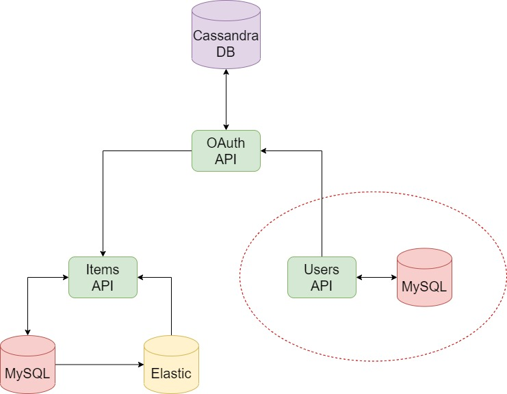

# Bookstore Users API
 
A Golang microservice that will be used as an Users API to handle and store differents users.

## Architecture



## Requirements

### Standalone

* [MySQL](https://www.mysql.com/)

### Running a container

* [Docker](https://docs.docker.com/get-docker/)
* [MySQL image](https://hub.docker.com/_/mysql)

## Before running

This app collect some data from env, bellow you can find a list of all vars and their values:

|       Variable       |   Description   |
|:--------------------:|:---------------:|
| mysql_users_username |  Database User  |
| mysql_users_password |  Database Pass  |
|   mysql_users_host   |  Database URL   |
|  mysql_users_schema  | Database Schema |

Inside this folder you will find a file called *migration.sql*, run it in your database.

### Creating the container

While the same folder of Dockerfile, run:

``` shell
docker build --tag bookstore_users-api:latest .
```

## Running


``` shell
go run *.go
```

### Running as container

Starting MySQL container:

``` shell
docker run --name mysql --network host -e MYSQL_ROOT_PASSWORD=root -d mysql:latest
```

Remember to run *migration.sql* in your database

Starting the app

``` shell
docker run -ti -e mysql_users_username=root -e mysql_users_password=root -e mysql_users_host=0.0.0.0:3306 -e mysql_users_schema=users_db --network host bookstore_users-api:latest
```

## API

Inside [docs](https://github.com/ZerepL/bookstore_users-api/tree/main/docs) you can find a swagger file with all details about API.

### /users/

| Function      | Method | Path  | Expected |
|:-------------:|:------:|:-----:|:--------:|
|  Get user     |  GET   | /{id} |  Int     |
|  Create new   |  POST  | /     | JSON     |
|  Update user  |  PUT   | /{id} | JSON     |
|  Patch user   |  Patch | /{id} | JSON     |
|  Delete user  | DELETE | /{id} | Int      |

#### Create user payload

``` json
{
    "first_name": "x",
    "last_name": "x",
    "email": "x@email.com",
    "password": "batatinha-1"
}
```

#### Update user payload

``` json
{
    "first_name": "x",
    "last_name": "x",
    "email": "x@email.com"
}
```

#### Patch user payload

It can be any field of update payload.

### /internal/

| Function      | Method | Path                          | Expected |
|:-------------:|:------:|:-----------------------------:|:--------:|
| Search status |  GET   | /users/search?status={status} |  String  |

#### Status available

* Active

## TODO

* Add tests
* Create deployment for K8s

## Credits

This microservice is based in this [course](https://www.udemy.com/course/golang-how-to-design-and-build-rest-microservices-in-go/)
